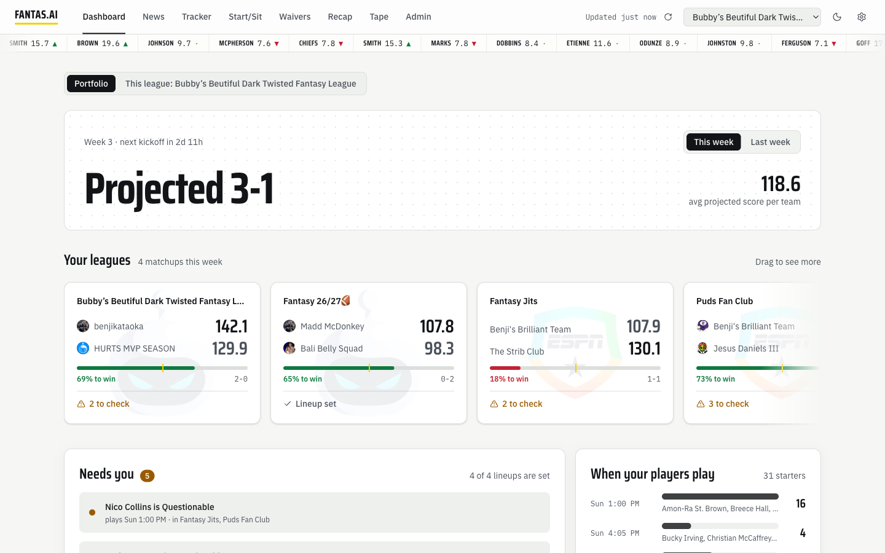
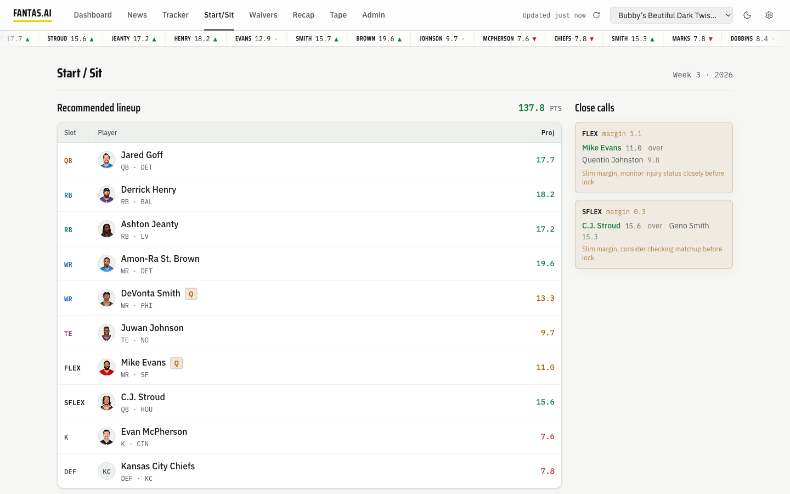
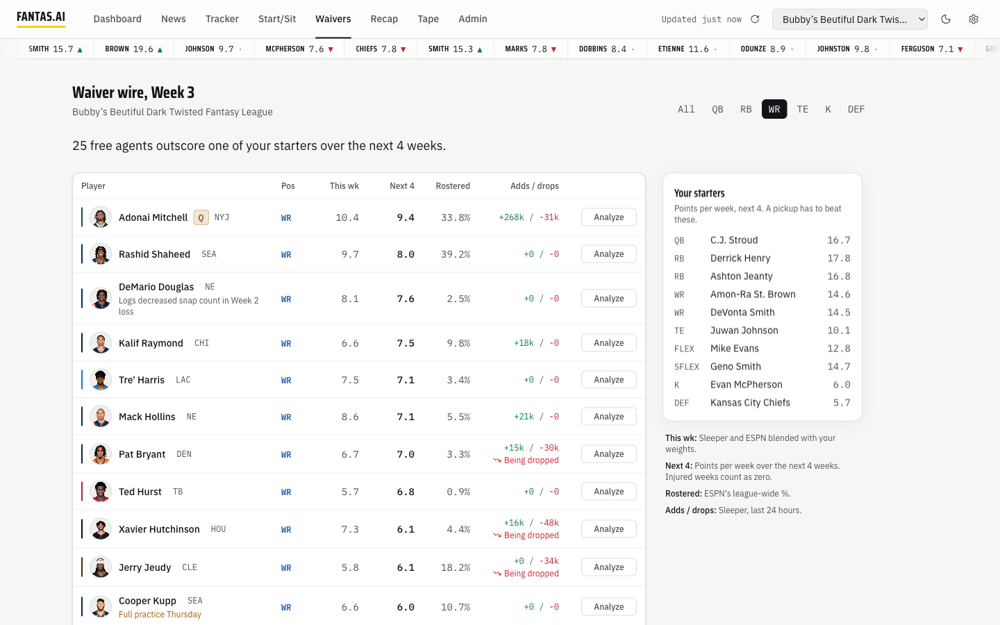
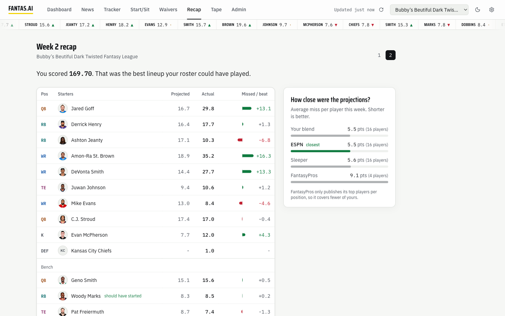
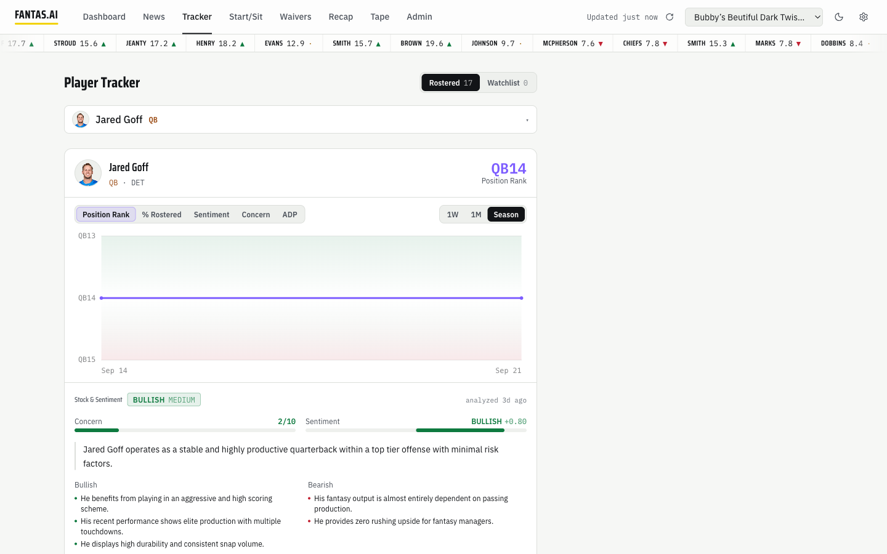
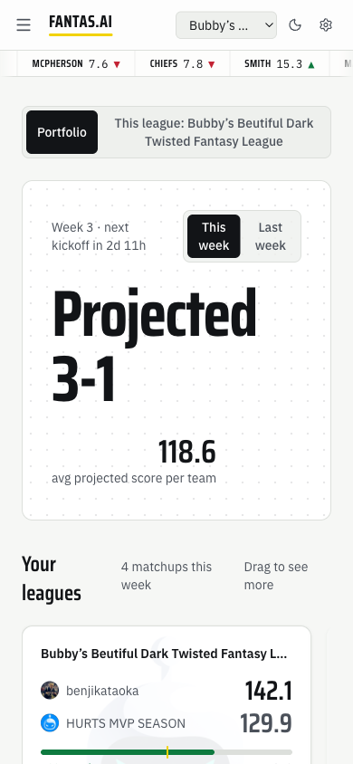
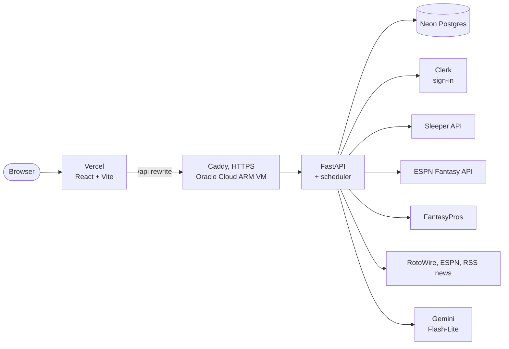

# Fantas.ai

### [Try the live demo](https://fantas-ai.vercel.app/demo)

A fantasy football assistant for my redraft league. It pulls every team you own across
Sleeper and ESPN into one place, blends three projection sources into one number per
player, and tells you who to start, who to pick up, and how last week went.

[](https://fantas-ai.vercel.app/demo)

**What it does**

- **Portfolio**: all your leagues on one board, with live scores during games and a projected record for the week.
- **Start/Sit**: the best legal lineup for your league's real slots (FLEX, Superflex, DEF), plus the close calls.
- **Waivers**: the free agents who would actually beat one of your starters over the next four weeks.
- **Recap**: a finished week graded: points you left on the bench, and which projection source was closest.
- **Player tracker**: an AI read on each player's outlook from career stats, news and ADP, tracked over the season.

**[Open the demo](https://fantas-ai.vercel.app/demo)**: the real app on one recorded week,
with no sign-in. League and team names are made up; the players and numbers are real. The
live app is invite-only for my league.

## Why I built this

I play in leagues on both Sleeper and ESPN, and keeping up with them meant jumping
between apps just to see how my teams were doing. The companion tools that pull
everything into one place mostly sit behind a paywall, so I built my own.

Fantas.ai is one hub for all of it: every team I own on one board, with the latest on
every player I have. One card I check every week lists my starters by kickoff time, so I
know which games to watch before the weekend starts.

## Screenshots

| Start/Sit | Waivers |
|---|---|
|  |  |
| **Recap** | **Player tracker** |
|  |  |

<p align="center">
  
</p>

## How it's built



| Layer | Choice |
|---|---|
| Frontend | React 19, Vite, Tailwind CSS v4, shadcn/ui |
| Backend | Python, FastAPI (async), SQLAlchemy 2 async + asyncpg, Alembic |
| Database | Neon serverless Postgres |
| Auth | Clerk, with JWTs verified on the server and an admin approval gate |
| AI | Google Gemini (Flash-Lite), on the free tier |
| Jobs | APScheduler in the API process: roster sync, market data, player analysis |
| Hosting | Oracle Cloud Always Free (API), Vercel (frontend), DuckDNS + Caddy for HTTPS |

Total hosting cost is $0. The server holds no data, so if it disappears the rebuild is one
script ([deploy/](deploy/README.md)).

## Running it locally

You need Python 3.14, Node 20.19+ or 22.12+, a Postgres database (Neon's free tier works), a Gemini API
key and a Clerk application.

```bash
cp .env.example .env                  # fill in the values; each one is documented there

python3 -m venv backend/venv && source backend/venv/bin/activate
pip install -r backend/requirements.lock
cd backend && alembic upgrade head && uvicorn main:app --reload --port 8000

cd frontend && npm install && npm run dev     # http://localhost:3000
```

Without `CLERK_SECRET_KEY`, the API runs as a single local user with sign-in turned off.

**Tests**: 28 backend test files, one per service or router, each runnable on its own
(`python3 tests/test_waiver_service.py` from `backend/`). Pure logic like lineup solving
and win probability is tested against hand-checked numbers; the router tests hit a real
database.

## About

Built by Benjamin Kataoka. [LinkedIn](https://www.linkedin.com/in/benjamin-kataoka/)

Player and league data belong to Sleeper, ESPN and FantasyPros. This is a personal project
with no affiliation to any of them or to the NFL.
